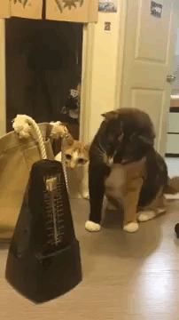
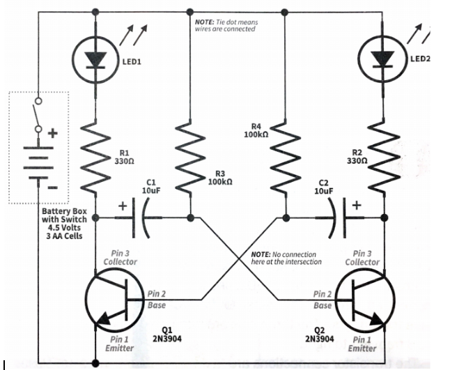

# Electronic Skills 5: [Blinkenlights](http://helpdesk.esf.edu/cns/portals/0/Files/Documents/jargon-4.4.5/html/B/blinkenlights.html)
In this assignment you build a circuit with two LEDs blinking back and forth. This circuit is a electronic version of a [metronome](https://en.wikipedia.org/wiki/Metronome) and can be used as a timing device for circuits. Metronomes can be confusing and scary for cats.

## Instructions
In this circuit you are introduced to the capacitor. Start by watching the following videos: 
* [MAKE Presentes: The Capacitor](https://youtu.be/ZYH9dGl4gUE) 
* [What Are Capacitors?](https://youtu.be/4Hg7SLhetXM) 
* [How Capacitors Work](https://youtu.be/5hFC9ugTGLs)

Study the attached circuit diagram and identify the components and (if necessary) review their functionality. You need to know what the different components do in the circuit and how they work, e.g. identify the terminals, possible polarization, etc. You will be using your battery pack to power the circuit. Make sure you watch the attached videos to help you understand how capacitors works. Keep in mind that the circuit diagram does not represent the layout of the components on the breadboard, but rather it represents the connections you need to create between the components on the breadboard.
Show the circuit to your teacher for marking.   

## What is happening in this circuit?
The transistor switch turns the LEDs on and off. The base of the transistor (pin 2) is like a light switch handle, and it turns the transistor on when current goes through it. When the transistor is on, current flows through the transistor from pin 3 to pin 1, turning on the LED. The LED produce light when current flows through them. The 330 ohms resistors set the LED brightness. When the LED is on, current is flowing through the LED, through the resistor and through the transistor.
 
The 10 microFarad capacitors and the 100 kiloOhms resistor control how fast the LEDs flash. Capacitors hold electric charge, like tiny electron buckets. They fill up and empty over and over, back and forth between the left and right capacitors. The capacitors are connected to the transistor bases, so they turn the transistors on when they charge up. The 100 kiloOhms resistors control how fast they charge up. The following videos shows what happens to the current in the circuit as the capacitors charge and discharge: [Video 1](https://youtu.be/IvFVu7Jxa2I)  and [Video 2](https://youtu.be/5D2cLj28Pc8).
 
Changing the 100 kiloOhms resistor or the capacitor sizes changes the flash rate. Large value capacitors take longer to charge up, so the LEDs flash more slowly. If the resistors are made smaller, more current flows through them, charging the capacitors faster, which causes the LEDs to flash faster.
 
The transistors and capacitors are cross connected so that when one transistor and LED turns on, it turns the other side off. The capacitors fill and empty back and forth, turning on a transistor and LED, one side, then the other and back again.
